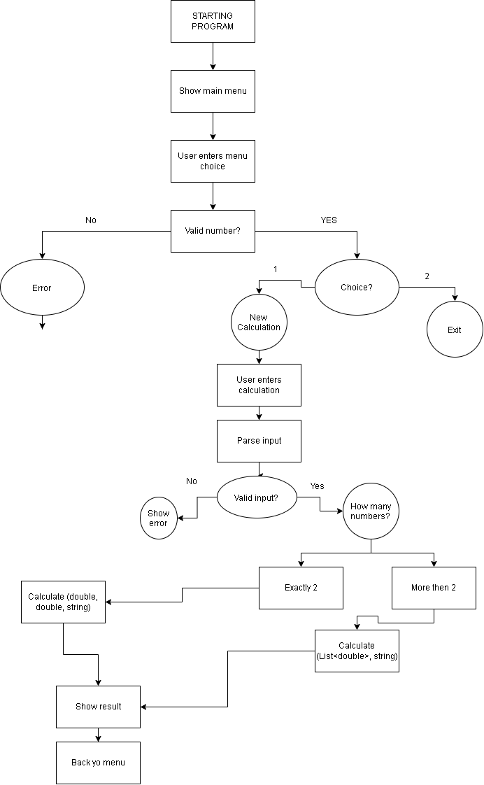

# Kalkulator innlevering

## Om

En kalkulator laget for uke 3 oppgave for kodehode.
Denne kalkulatoren ble laget for å lære om method overloading, bruker inpus, parsing, lists, loops og program flow i C#.

## Features

- Plus
- Minus
- Ganger
- Deling
- Rest
- Støtte for 2 eller flere tall.
- Akkepterer kalkulasjoner med eller uten mellomrom.
- Input validering
- Bruker method overloading

## Pseudocode
START

Create a Calculator object

WHILE calculator is running

    Display main menu
        1. New calculation
        2. Exit

    Ask user to choose an option

    IF user chooses 1

        Ask user to enter a calculation
        Example: 10 + 15 + 30

        Read the user's input

        Add spaces around the supported operators
        Split the input into separate parts

        Create an empty list for numbers
        Create an empty variable for the operator
        Set input as valid

        FOR each part of the input

            IF the part is a number
                Add the number to the list

            ELSE IF the part is a supported operator

                IF no operator has been selected
                    Store the operator

                ELSE IF the operator is different
                    Show an error
                    Mark input as invalid

            ELSE
                Show an error
                Mark input as invalid

        IF there are not enough numbers
            Show an error
            Mark input as invalid

        IF no operator was entered
            Show an error
            Mark input as invalid

        IF input is valid

            IF there are exactly two numbers
                Call the Calculate overload for two numbers

            ELSE
                Call the Calculate overload for a list of numbers

            Display the result

    ELSE IF user chooses 2

        Stop the calculator

    ELSE

        Show an error

END WHILE

END 

## Flowchart

